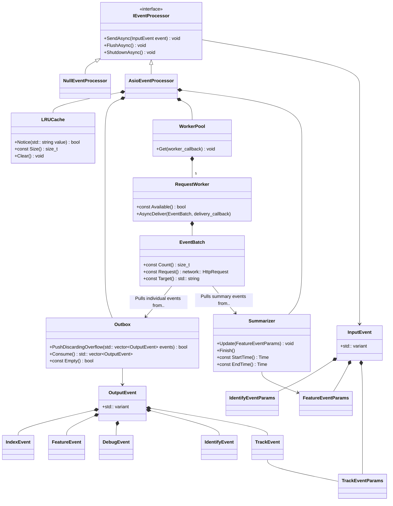

# Analytic Event Processor

The Event Processor is responsible for consuming, batching, and delivering events generated
by the server and client-side LaunchDarkly SDKs.

### Notes

SDKs may be configured to disable events, so `NullEventProcessor` is made available. This component accepts
events generated
by the SDK and discards them.

If events are enabled, SDKs use the `AsioEventProcessor` implementation, which is an asynchronous processor
utilizing `boost::asio`.

Most event definitions are shared between the server and client-side SDKs. Unique to the server-side SDK
is `IndexEvent`.
