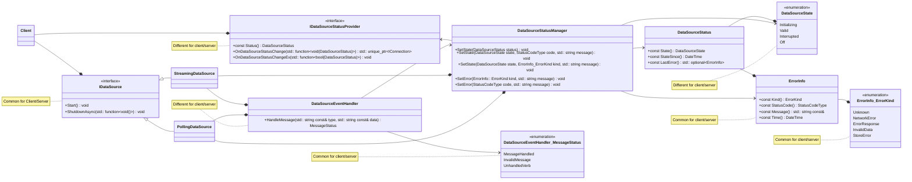

# Server Data Source Architecture

```mermaid
classDiagram
    direction LR
    Client --* IDataSource
    Client --* IDataSourceStatusProvider
    IDataSource <|-- PollingDataSource
    IDataSource <|-- StreamingDataSource
    PollingDataSource --* DataSourceStatusManager
    StreamingDataSource --* DataSourceStatusManager
    PollingDataSource --* DataSourceEventHandler
    StreamingDataSource --* DataSourceEventHandler
    DataSourceEventHandler --> DataSourceStatusManager
    IDataSourceStatusProvider <-- DataSourceStatusManager
    DataSourceStatusManager --> DataSourceState
    DataSourceStatusManager --> ErrorInfo
    DataSourceStatusManager --> DataSourceStatus
    DataSourceStatus --* DataSourceState
    DataSourceStatus --* ErrorInfo
    DataSourceEventHandler --> DataSourceEventHandler_MessageStatus
    note for IDataSource "Common for Client/Server"

    class IDataSource {
        <<interface>>
        +Start() void
        +ShutdownAsync(std:: function~void&#40&#41~) void
    }

    note for IDataSourceStatusProvider "Different for client/server"

    class IDataSourceStatusProvider {
        <<interface>>
        +const Status() DataSourceStatus
        +OnDataSourceStatusChange(std:: function&lt;void&#40DataSourceStatus&#41&gt;) std:: unique_ptr~IConnection~
        +OnDataSourceStatusChangeEx(std:: function&lt;bool&#40DataSourceStatus&#41&gt;) void
    }

    note for DataSourceState "Different for client/server"

    class DataSourceState {
        <<enumeration>>
        Initializing
        Valid
        Interrupted
        Off
    }

    note for ErrorInfo_ErrorKind "Common for client/server"

    class ErrorInfo_ErrorKind {
        <<enumeration>>
        Unknown
        NetworkError
        ErrorResponse
        InvalidData
        StoreError
    }

    note for ErrorInfo "Common for client/server"
    ErrorInfo --* ErrorInfo_ErrorKind

    class ErrorInfo {
        +const Kind() ErrorKind
        +const StatusCode() StatusCodeType
        +const Message() std:: string const&
        +const Time() DateTime
    }

    class PollingDataSource {
    }

    class StreamingDataSource {
    }

    note for DataSourceEventHandler "Different for client/server"

    class DataSourceEventHandler {
        +HandleMessage(std:: string const& type, std:: string const& data) MessageStatus
    }

    note for DataSourceEventHandler_MessageStatus "Common for client/server"

    class DataSourceEventHandler_MessageStatus {
        <<enumeration>>
        MessageHandled
        InvalidMessage
        UnhandledVerb
    }

    class DataSourceStatus {
        +const State() DataSourceState
        +const StateSince() DateTime
        +const LastError() std:: optional~ErrorInfo~
    }

    class DataSourceStatusManager {
        +SetState(DataSourceStatus status) void
        +SetState(DataSourceState state, StatusCodeType code, std:: string message) void
        +SetState(DataSourceState state, ErrorInfo_ErrorKind kind, std:: string message) void
        +SetError(ErrorInfo:: ErrorKind kind, std:: string message) void
        +SetError(StatusCodeType code, std:: string message) void
    }

```
