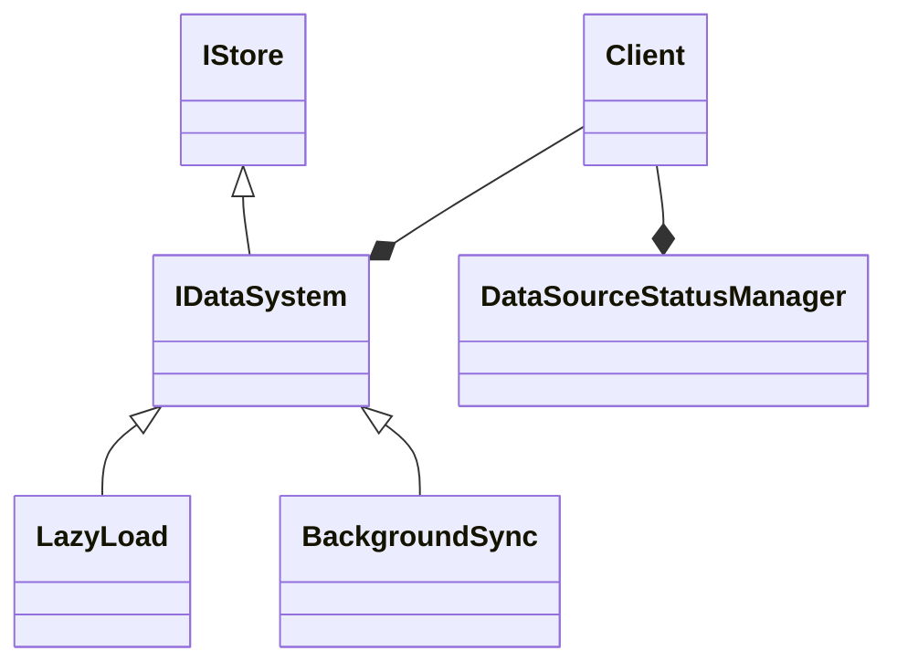
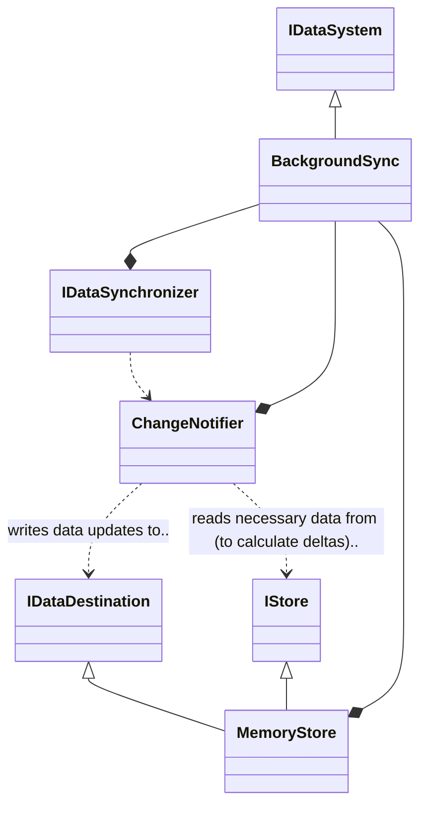
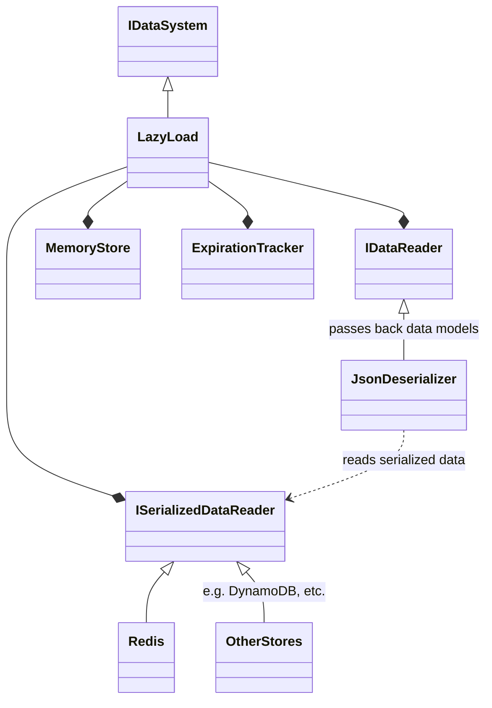

# Server Data System Architecture

**Client's usage of the Data System**

**Data System - Background Sync**

In order to satisfy `IDataSystem`, the Background Sync system owns a Memory Store, a Change Notifier,
and an `IDataSynchronizer`.

Because `IDataSystem` is an `IStore`, Background Sync provides pass-through methods to the Memory Store.

Meanwhile, data updates are received from LaunchDarkly via the `IDataSynchronizer`, and then forwarded into
the `IDataSynchronizer`'s destination - which is a Change Notifier object owned by Background Sync.

The Change Notifier wants to read existing flag/segment data (`IStore`) to compare
it to the data it receives from the synchronizer, and then:

- Send out change updates
- Store the updated data (`IDestination`), while guarding against stale data

Because all flag/segment data is stored in memory, the Memory Store satisfies Change Notifier's `IStore`
and `IDestination`
dependencies.

**Data System - Lazy Load**

In contrast to Background Sync, Lazy Load actively implements `IStore` by fetching data items from
an `ISerializedDataReader`
via `IDataReader` and placing them in a Memory Store cache.

Items are cached for a period of time after which they are considered stale and refreshed. This logic is implemented
by the Expiration Tracker.

Currently, Lazy Load only supports JSON as a storage format.

In practice, the `IDataReader` is therefore a `JsonDeserializer`. Theoretically it could be swapped out for dealing with
(for example) protobuf.

The `JsonDeserializer` sits in between the Lazy Load system and its `ISerializedDataReader`, intercepting requests.

For example, when it receives a request to get a flag `foo` it forwards that to `ISerializedDataReader`, receives a JSON
string as a response,
deserializes that into the SDK's data model, and passes it back to the Lazy Load system.
