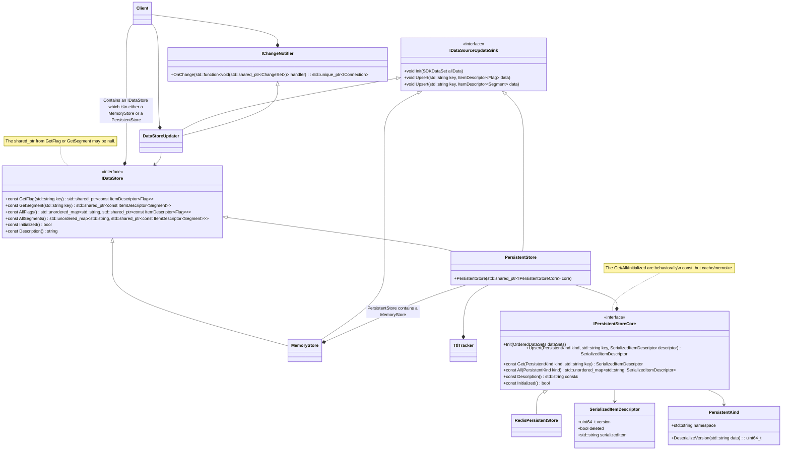

# Server Data Store Architecture

```mermaid

classDiagram
    Client --* IDataStore : Contains an IDataStore which is\n either a MemoryStore or a PersistentStore
    Client --* DataStoreUpdater
    Client --* IChangeNotifier
    
    IDataStore <|-- MemoryStore
    IDataSourceUpdateSink <|-- MemoryStore

    IDataStore <|-- PersistentStore
    IDataSourceUpdateSink <|-- PersistentStore
    IDataSourceUpdateSink <|-- DataStoreUpdater
    
    IChangeNotifier <|-- DataStoreUpdater
    
    DataStoreUpdater --> IDataStore
    
    PersistentStore --* MemoryStore : PersistentStore contains a MemoryStore
    PersistentStore --* TtlTracker

    IPersistentStoreCore <|-- RedisPersistentStore

    note for IPersistentStoreCore "The Get/All/Initialized are behaviorally\n const, but cache/memoize."
    
    IPersistentStoreCore --> SerializedItemDescriptor
    IPersistentStoreCore --> PersistentKind
    PersistentStore --* IPersistentStoreCore

    class PersistentKind{
        +std::string namespace
        %% There are some cases where the store may need to extract a version from the serialized representation.
        %% Specifically when the store cannot put the version in a column, such as with Redis.
        +DeserializeVersion(std::string data): uint64_t
    }

    class SerializedItemDescriptor{
        +uint64_t version
        +bool deleted
        +std::string serializedItem
    }

    class IPersistentStoreCore {
        <<interface>>
        +Init(OrderedDataSets dataSets)
        +Upsert(PersistentKind kind, std::string key, SerializedItemDescriptor descriptor) SerializedItemDescriptor

        +const Get(PersistentKind kind, std::string key) SerializedItemDescriptor
        +const All(PersistentKind kind) std::unordered_map&lt;std::string, SerializedItemDescriptor&gt;

        +const Description() std::string const&
        +const Initialized() bool
    }


    class IDataSourceUpdateSink{
        <<interface>>
        +void Init(SDKDataSet allData)
        +void Upsert(std::string key, ItemDescriptor~Flag~ data)
        +void Upsert(std::string key, ItemDescriptor~Segment~ data)
    }
    
    note for IDataStore "The shared_ptr from GetFlag or GetSegment may be null."

    class IDataStore{
        <<interface>>
        +const GetFlag(std::string key) std::shared_ptr&lt;const ItemDescriptor&lt;Flag&gt;&gt 
        +const GetSegment(std::string key) std::shared_ptr&lt;const ItemDescriptor&lt;Segment&gt;&gt
        +const AllFlags() std::unordered_map&lt;std::string, std::shared_ptr&lt;const ItemDescriptor&lt;Flag&gt;&gt&gt;
        +const AllSegments() std::unordered_map&lt;std::string, std::shared_ptr&lt;const ItemDescriptor&lt;Segment&gt;&gt&gt;
        +const Initialized() bool
        +const Description() string
    }

    class TtlTracker{
    }

    class MemoryStore{
    }

    class PersistentStore{
        +PersistentStore(std::shared_ptr~IPersistentStoreCore~ core)
    }

    class RedisPersistentStore{

    }
    
    class IChangeNotifier{
        +OnChange(std::function&lt;void(std::shared_ptr&lt;ChangeSet&gt;)&gt; handler): std::unique_ptr~IConnection~
    }
    
    class DataStoreUpdater{
        
    }
```